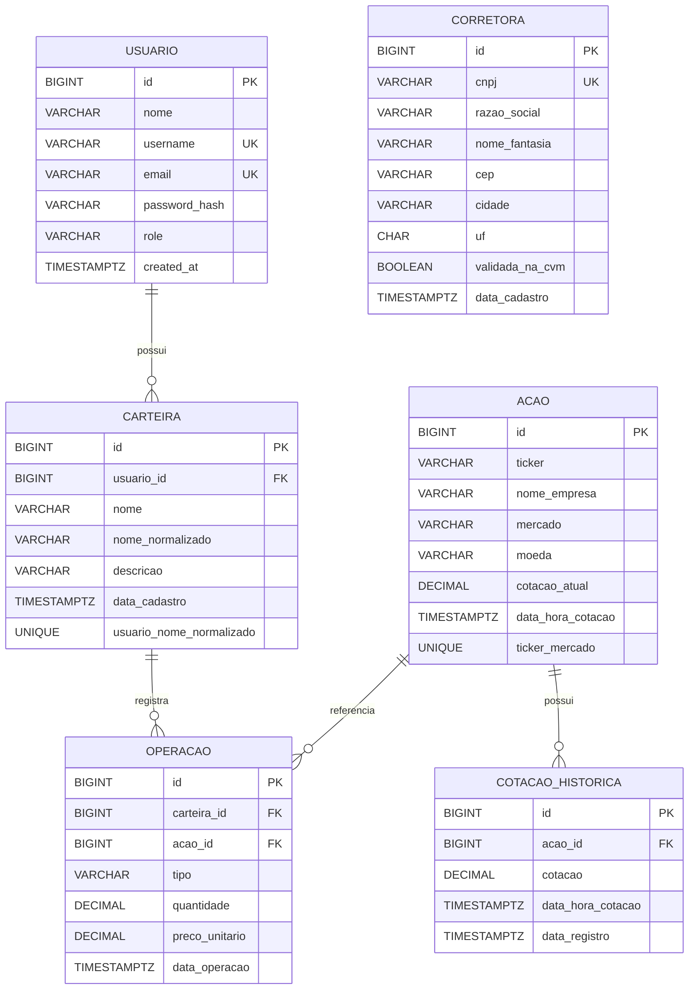

# Modelo persistido de entidades

O diagrama representa as tabelas e relacionamentos atuais. `Corretora` não possui associação persistida com `Acao`.

`CARTEIRA.usuario_id` é obrigatório. Seu nome normalizado é único somente dentro do mesmo usuário, conforme V8. `OPERACAO` referencia obrigatoriamente uma carteira e uma ação; `COTACAO_HISTORICA` referencia obrigatoriamente uma ação.

`ACAO` é global e sua identidade persistida é `(ticker, mercado)`. Cotações, quantidades e preços monetários usam `NUMERIC(19,8)` no schema atual.
