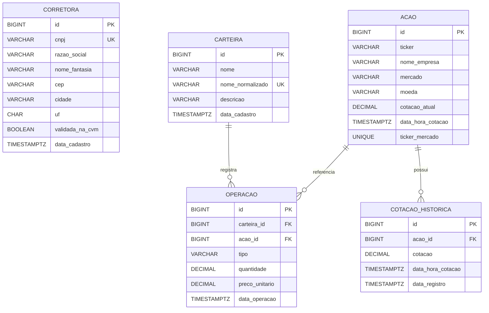

# Modelo persistido de entidades

O diagrama representa as tabelas e relacionamentos atuais. `Corretora` não possui associação persistida com `Acao`.

`OPERACAO` é obrigatoriamente ligada a uma `CARTEIRA` e uma `ACAO`. `COTACAO_HISTORICA` é obrigatoriamente ligada a uma `ACAO`. As cotações, quantidades e preços monetários usam precisão `NUMERIC(19,8)` no schema atual.
