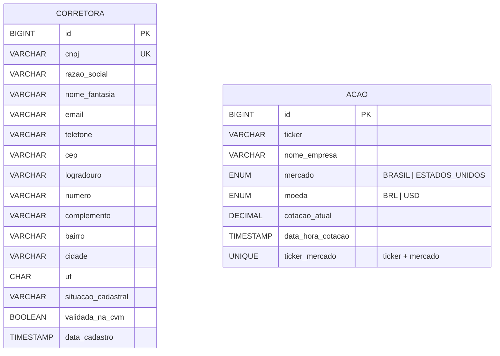

# Modelo simplificado de entidades

O diagrama representa o modelo persistente atual. `Acao` é um cadastro mestre identificado logicamente por `(ticker, mercado)`; não há relacionamento obrigatório com `Corretora`.

`CORRETORA` e `ACAO` não possuem aresta no diagrama porque o modelo atual não persiste associação entre elas.
